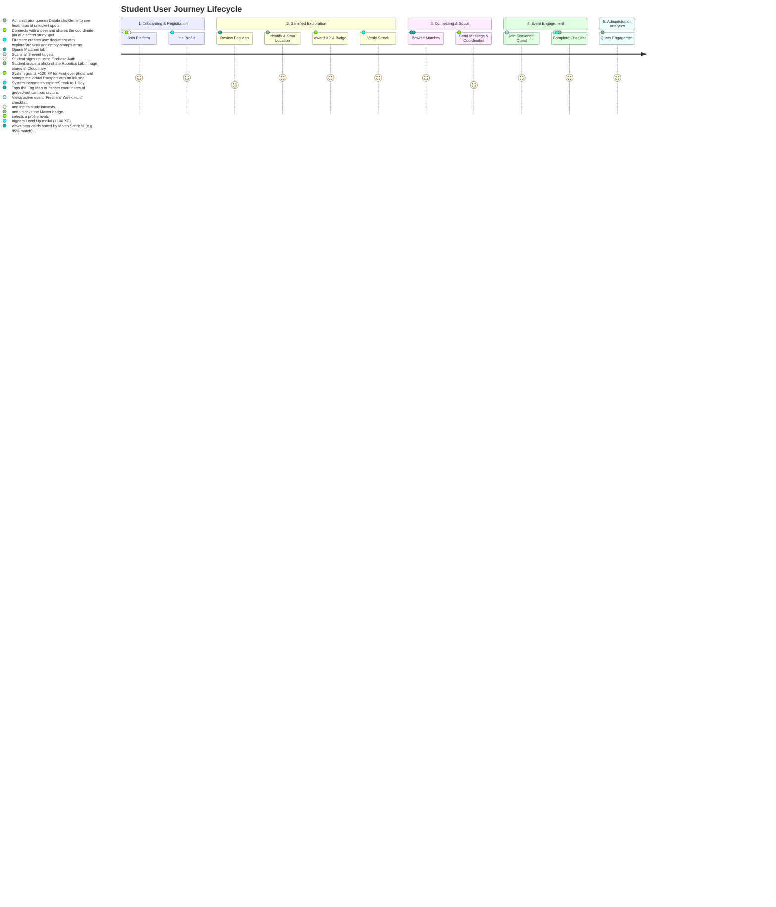

# 🗺️ Campus Social & Intelligence Platform - Full Project Architecture & Design Document

This document outlines the complete architectural design, end-to-end tech stack, data flows, user journeys, and database schemas for the **Campus Social & Intelligence Platform**. 

This comprehensive guide serves as both the system design blueprint and user feature manual.

---

## 1. End-to-End System Architecture

```mermaid
graph TD
    User([📱 Mobile Client]) -->|HTTPS / WSS| Server[⚙️ Node.js API Server on Render]
    
    subgraph Frontend Client (Vercel Free Tier)
        User
    end

    subgraph Serverless Backend & Database (Firebase Free Tier)
        Server -->|Sync Data| DB[(🔥 Google Firestore NoSQL DB)]
        Auth[🔑 Firebase Auth]
        S3[📦 Cloudinary Object Storage]
    end

    subgraph Enterprise Analytics & AI Genie Agent (Databricks)
        DB -->|Sync Connector / GCS| Lake[🌊 Delta Lakehouse]
        Lake -->|Query Engine| Genie[🧠 Databricks Genie Agent]
    end

    subgraph Third-Party integrations (Free Tiers)
        Server -->|Image Uploads| S3
        User -->|Login authentication| Auth
    end
```

---

## 2. Tech Stack Breakdown (What Each Part is Used For & Free Tier Availability)

Every choice in this stack is selected to provide a **100% free-to-start development environment** with robust pricing tiers that scale up only when user traffic increases.

### A. Frontend (Client Tier)
*   **Next.js 14 & React 18**: A framework for building rapid, interactive mobile-responsive views.
*   **Hosting Provider**: **Vercel (Hobby Free Tier)**. 
    *   *What it is used for*: Deploys and serves the static assets, Next.js page routing, and animations.
    *   *Free limits*: Unlimited deployments, free custom domain connection (SSL included), and 100 GB bandwidth per month.

### B. Backend API & Real-time (Application Tier)
*   **Node.js & Express**: Simple, lightweight JavaScript server for managing scans, connections, and forum comments.
*   **Hosting Provider**: **Render (Free Web Services Tier)** or **Firebase Cloud Functions (Spark Free Tier)**.
    *   *What it is used for*: Handles incoming scan photo uploads, runs streak algorithms, and broadcasts active messaging triggers.
    *   *Free limits*: Firebase gives 2 million cloud execution invocations free per month. Render provides free web service hosting with automatic scaling.

### C. Database (Storage Tier)
*   **Google Cloud Firestore**: A serverless, NoSQL document-based database.
*   **Hosting Provider**: **Firebase Console / Google Cloud Platform (GCP Free Tier)**.
    *   *What it is used for*: Replaces traditional SQL databases to store unstructured JSON documents for users, DM chat threads, forum threads, map coordinates, and stamp items.
    *   *Free limits*: Highly generous **No-Credit-Card Free Tier** providing **50,000 free reads, 20,000 free writes, 20,000 free deletes per day**, and 1 GiB of permanent data storage.

### D. File Storage (Asset Tier)
*   **Cloudinary**: Media management platform.
*   **Hosting Provider**: **Cloudinary (Free Tier)**.
    *   *What it is used for*: Hosts uploaded images of campus spots taken by users. Instantly resizes and compresses photos on-the-fly to load quickly on mobile devices.
    *   *Free limits*: 25 free credits per month (equal to **25 GB of image storage or 25,000 image transformations**).

### E. AI Analytics (Databricks Genie Agent Tier)
*   **Databricks AI/BI Genie Agent**: A conversational data assistant that translates natural language queries into SQL to retrieve analytics from database storage.
*   **Hosting Provider**: **Databricks Community Edition (Free Tier)** combined with Firestore-to-Lakehouse sync.
    *   *What it is used for*: Allows administrators or students to ask conversational questions (e.g. *"Show me the most scanned building this week"* or *"How many students unlocked the Library stamp?"*) and displays automated charts and tables.
    *   *How it works*: Firestore database changes are automatically synced to Google Cloud Storage (GCS free tier up to 5 GB) using a Firebase Extension. Databricks mounts this GCS bucket as an external Delta Lake table, which the Genie Agent queries.

---

## 3. Comprehensive User Features Explanation

### 📸 A. Campus Scanner
*   **Purpose**: The primary exploratory mechanic of the application. Allows students to physically interact with their environment and "capture" spots on campus to log achievements.
*   **User Action**: The student visits a location, opens the Scanner, and uploads a photograph. 
*   **Behind the Scenes**: 
    1. The client captures the photo and sends the data (with GPS coordinates metadata) to the API.
    2. The API saves the photo to **Cloudinary** and maps the geolocation to a campus spot database.
    3. Points are awarded based on **Rarity Tiers**:
        *   *First to Document*: Scanned for the very first time on campus (+120 XP & "Pioneer Documenter" Badge).
        *   *Hidden Gem*: Scanned by fewer than 5% of users (+80 XP).
        *   *Secret Sanctuary*: Scanned by fewer than 15% of users (+60 XP).
        *   *Common Hotspot*: Publicly popular spaces (+30 XP).
    4. Reacting to the API success, the UI triggers a dynamic Toast alert, updates the user's level bar, and reveals coordinates.

### 🗺️ B. Fog-of-War Map
*   **Purpose**: Gamifies navigation by turning the physical campus into a map template that students must unlock tile-by-tile.
*   **User Action**: The student taps the **Fog Map** tab to view a 2x2 grid representing sectors (Engineering, Library, Canteen, Amphitheater).
*   **Behind the Scenes**: 
    1. Initially, tiles have `isRevealed: false` and are greyed out, hiding details.
    2. Once the student scans a location associated with a sector (e.g. "Robotics Lab" -> Engineering sector), Firestore updates the sector to `isRevealed: true`.
    3. The gray overlay dissolves, exposing coordinate lines and a color-coded icon representing the building type (`Cpu`, `BookOpen`, `Coffee`, `Music`). Clicking the revealed tile allows the user to view student tips and facility logs.

### ✈️ C. Campus Passport & Stamp Collection
*   **Purpose**: Creates a physical-feeling collection notebook showing the history of student exploration.
*   **User Action**: Tapping the **Passport** subtab shows a grid of locked/unlocked stamp slots.
*   **Behind the Scenes**: 
    1. For each newly unlocked location, a virtual circular ink seal is stamped onto the page showing the location's initials and rarity.
    2. Completed building sets (e.g., scanning all rooms inside Engineering Block C) automatically unlock custom badges (e.g., "Engineering Scholar") and award profile background frames.

### 🔥 D. Explore Streaks
*   **Purpose**: Encourages daily engagement and keeps the community active.
*   **User Action**: A streak flame counter widget appears in the Scanner tab (e.g. `🔥 3 Day Streak`).
*   **Behind the Scenes**: 
    1. Daily streak rules compare the current scan date against the user's `lastScanDate` using timezone-safe UTC `.toDateString()` checks.
    2. If the difference is exactly 1 day, the streak increments. A successful consecutive scan triggers a `+25 XP Streak Bonus`.
    3. If the difference is greater than 1 day, the streak resets to 1. If scanned on the same day, the streak remains intact without awarding duplicate points.

### ⚡ E. Seasonal Event Quests (Scavenger Hunts)
*   **Purpose**: Boosts student interaction during special events (like Freshers' Week or college festivals).
*   **User Action**: A purple "Live Event" quest card displays a checklist of spots to find (e.g., "Find and photograph 3 specific spots").
*   **Behind the Scenes**: 
    1. In the database, the active quest tracks target location IDs.
    2. As the user scans campus spots, the system cross-references them.
    3. Completing all checkpoints triggers a celebratory overlay, unlocks the "Scavenger Master" badge, and yields +100 XP.

### 🗣️ F. Hub Matches & Discussions
*   **Purpose**: Helps freshman find project partners, study groups, or peer circles.
*   **User Action**: User browses the **Hub** tab to view matching profiles or write forum posts.
*   **Behind the Scenes**:
    1. **Matching Heuristics**: The app automatically computes overlap percentages between the user's skills/hobbies and peers:
        $$\text{Match Score} = 30\% + \left( \frac{\text{Shared Interests} \cap \text{Shared Hobbies}}{\text{Total Interests}} \times 70\% \right)$$
    2. Connecting with a student initiates a direct messaging connection.
    3. **Forum Board**: Organized by category filters (#Hackathons, #Workshops, #Q&A). Tapping posts opens discussion threads where students can reply in real-time.

### 💬 G. Direct Messaging & Coordinates Sharing
*   **Purpose**: Seamless private communication between study buddies and teams.
*   **User Action**: Tapping **Message** on a student's card opens the Inbox.
*   **Behind the Scenes**:
    1. Supports instant texts and photos.
    2. **Campus Pin Sharing**: Users can click the map pin icon to share a verified campus spot directly into the chat. The receiver can click the shared card to instantly open its coordinates and details on the Explorer map.

### 🧠 H. Databricks Genie Agent (Analytics Dashboard)
*   **Purpose**: Enables campus administrators or event managers to ask query-less questions to understand campus flow.
*   **User Action**: Admins log into the Databricks Genie dashboard.
*   **Behind the Scenes**:
    1. Genie reads GCS tables synced from Firestore.
    2. The admin writes: *"Which block has the highest student traffic this week?"* or *"What is the distribution of unlocked badges?"*
    3. Genie automatically maps the words to database attributes, runs SQL, and outputs formatted charts.

---

## 4. End-to-End User Journey



### Detailed Journey Narrative:
1.  **Phase 1: Setup & Profile Personalization**: The student opens the application. They authenticate securely using **Firebase Authentication**. Upon entry, they are prompted to set up their student profile, selecting interests (e.g. *AI*, *Web Dev*), skills (e.g. *React*), and hobbies (e.g. *Chess*). This information is saved as a new document in the Firestore `/users` collection.
2.  **Phase 2: Fog Map Exploration**: Tapping the Explorer tab, the student views the grayed-out **Fog Map**. They see that the *Engineering Sector* is locked. They visit the Robotics Lab in person, open the **Scanner**, and take a photo. 
3.  **Phase 3: The Stamp Seal & XP Accumulation**: The server uploads the photo to **Cloudinary**, saves the scan to `/locations` and `/passport_stamps` in Firestore, and verifies it is the first time this spot has been photographed. The system rewards them with the **Pioneer Documenter** badge (+120 XP). The Engineering sector tile is revealed, turning bright purple, and an ink-seal stamp is stamped in their Passport.
4.  **Phase 4: Matchmaking & Shared Pins**: Having earned XP, the student is promoted to Level 2. The celebration overlay pops up. They visit the **Campus Matches** hub. The algorithm highlights another Level 2 student, *Alice*, who shares an interest in *AI* (yielding an "85% Match"). The user connects with Alice and opens a DM thread in the **Inbox**. They click the **Pin** icon and attach the verified Robotics Lab coordinates to the chat so Alice can find it.
5.  **Phase 5: Event Quests**: The user views the Live Event card on their dashboard. It lists a "Freshers' Week Hunt" to scan the *AI Lab*, the *Quiet Library*, and the *Canteen*. Since they have already scanned the AI Lab, it shows 1/3 progress. They visit the remaining locations to complete the quest, triggering a Level 3 promotion and the **Scavenger Master** badge.
6.  **Phase 6: Admin Dashboard Analysis**: Behind the scenes, Firestore data is synced to GCS. The campus coordinator accesses the **Databricks Genie Agent** and asks: *"Which building was scanned the most during Freshers' Week?"*. The Genie translates this into an analytical query and produces a clean bar chart showing that the Canteen had the most scans.

---

## 5. Google Firestore Document Schema (NoSQL Collections)

Firestore document structures that power the platform:

### 1. `users` Collection
*   **Path**: `/users/{userId}`
```json
{
  "name": "New Explorer",
  "username": "freshman_xyz",
  "avatarUrl": "https://images.unsplash.com/.../avatar.jpg",
  "bio": "CS freshman looking for hackathon teams.",
  "level": 1,
  "xp": 45,
  "interests": ["AI", "Chess", "Gaming"],
  "skills": ["React", "Python"],
  "hobbies": ["Coffee"],
  "exploreStreak": 1,
  "lastScanDate": "2026-08-29",
  "joinedDate": "2026-08-29T14:00:00Z"
}
```

### 2. `locations` Collection
*   **Path**: `/locations/{locationId}`
```json
{
  "name": "Robotics & AI Research Lab",
  "building": "Engineering Block C",
  "floor": "3rd Floor",
  "coordinates": "C3",
  "rarity": "First to Document",
  "description": "State-of-the-art facility featuring robotic arms, edge computing systems, and project workspace panels.",
  "facilities": [
    "High-speed Wi-Fi network",
    "Hardware workstation bays",
    "GPU compute clusters"
  ],
  "tips": [
    "Scan the QR code on the main doors to register temporary lab cards.",
    "Quiet environment—perfect for working on team coding sprints."
  ]
}
```

### 3. `passport_stamps` Collection
*   **Path**: `/users/{userId}/stamps/{stampId}`
```json
{
  "locationId": "loc_ai_lab",
  "unlockedAt": "2026-08-29T14:05:00Z",
  "isFirstDocumenter": true,
  "locationName": "Robotics & AI Research Lab"
}
```

### 4. `messages` Collection
*   **Path**: `/chats/{chatId}/messages/{messageId}`
```json
{
  "senderId": "me",
  "receiverId": "user_alice",
  "text": "Check out this spot!",
  "imageUrl": "https://res.cloudinary.com/.../lab.jpg",
  "sharedLocationId": "loc_ai_lab",
  "timestamp": "2026-08-29T14:10:00Z"
}
```

### 5. `discussion_posts` Collection
*   **Path**: `/posts/{postId}`
```json
{
  "authorId": "me",
  "authorName": "New Explorer",
  "authorAvatar": "https://images.unsplash.com/.../avatar.jpg",
  "title": "Anyone attending the Robotics Hackathon next Tuesday?",
  "content": "Looking to form a team of 3. I have React experience, looking for Python backend devs!",
  "tag": "Hackathons",
  "likes": 5,
  "timestamp": "2026-08-29T14:15:00Z"
}
```
