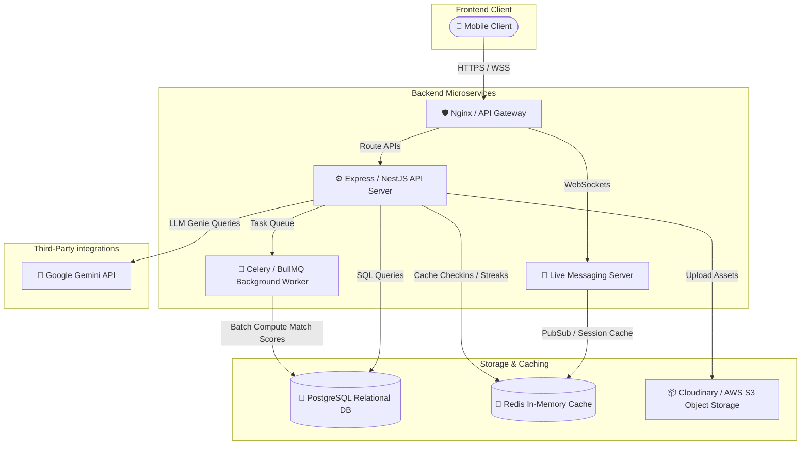
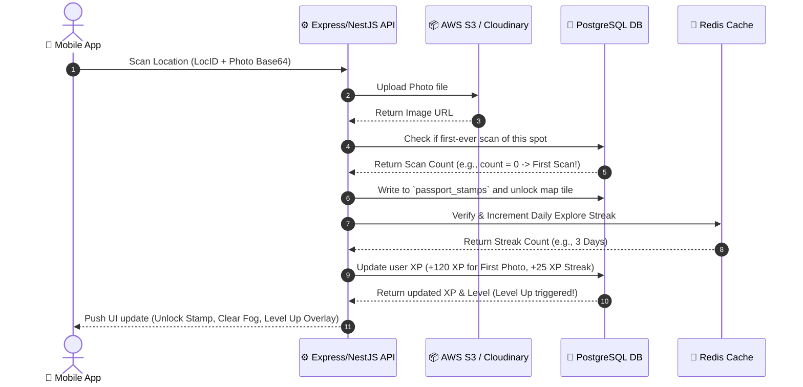
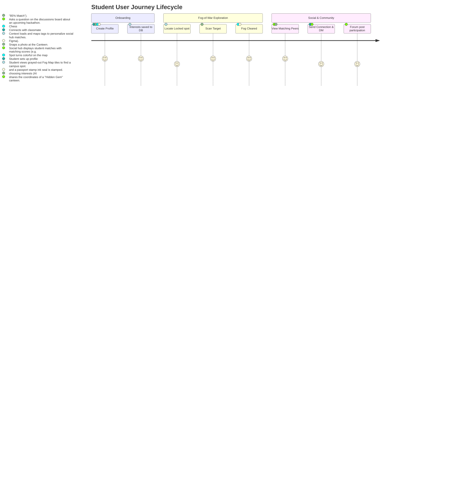

# 🗺️ Campus Social & Intelligence Platform - Full Project Architecture & Design Document

This document outlines the complete architectural design, end-to-end tech stack, data flows, user journeys, and database schemas for the **Campus Social & Intelligence Platform**. 

While the current codebase serves as a high-fidelity frontend prototype, this blueprint details the full production-ready implementation.

---

## 1. End-to-End Tech Stack



### 💻 Frontend (Client Tier)
*   **Framework**: Next.js 14 (App Router) & React 18.
*   **Styling**: Tailwind CSS (light-purple gaming palette: Ermine White, Candied Yam, Purple Illusionist).
*   **Icons**: Lucide React.
*   **State Management**: React Context API (with localStorage caching for offline capability).

### ⚙️ Backend (Application Tier)
*   **API Framework**: Node.js with **NestJS** or **Express** (written in TypeScript).
*   **WebSocket Gateway**: **Socket.io** for real-time messaging, instant matchmaking alerts, and typing indicators.
*   **Background Workers**: **BullMQ** (powered by Redis) for scheduling reset tasks, evaluating scavenger hunt completions, and daily explore streak expiration checks at midnight.
*   **AI Integration**: Node SDK for **Google Gemini API** to power the Genie Chatbot, utilizing system instructions seeded with campus guides, building directories, and classroom schedules.

### 🐘 Database & Cache (Data Tier)
*   **Primary Relational Database**: **PostgreSQL** (hosted via Supabase or AWS RDS) to store schemas for users, location logs, passport stamp sets, messages, and discussion threads.
*   **In-Memory Database & Cache**: **Redis** for storing active user sessions, temporary match scores, real-time message delivery queues, and daily heartbeat streak check-ins.
*   **Object Storage**: **AWS S3** or **Cloudinary** for uploading and hosting photos of campus locations taken by students.

---

## 2. Feature Explanations & Execution Flows

### A. Fog-of-War Map Unlocking
*   **Concept**: The campus is divided into geographic sector coordinates (e.g., Grid `[A1]`, `[B2]`). Initially, the map view is greyed out (in "fog").
*   **Flow**:
    1. Student visits a physical building, opens the scanner, and snaps a photo.
    2. The photo is sent to the backend, which matches metadata coordinates or visual markers.
    3. Once verified, the backend marks the associated `MapTile` as `isRevealed = true` in the DB.
    4. The client receives a WebSocket trigger to clear the gray overlay for that sector, revealing the colorful icon (`Cpu`, `BookOpen`, `Coffee`, `Music`) and detailed facilities list.

### B. Campus Passport & Stamp Sets
*   **Concept**: Every unique location scanned is logged in the user's permanent passport book as a virtual inked stamp.
*   **Flow**:
    1. On scanning a location, if `isFirstTimeScan = true`, a record is created in the `passport_stamps` table.
    2. The client displays a custom stamp showing the building's initials (e.g., "RA" for Robotics Lab) and the rarity tier of the spot.
    3. If the user completes a full building set (e.g., all 3 rooms in "Engineering Block C"), the system awards a rare building badge and +100 XP.

### C. Explore Streaks Engine
*   **Concept**: Encourages daily engagement by rewarding consecutive scan updates.
*   **Flow**:
    1. When a user scans a spot, the system checks `lastScanDate`.
    2. If `currentDate - lastScanDate == 1 day`, the streak counter increments by 1 and a `+25 XP Streak Bonus` is awarded.
    3. If `currentDate - lastScanDate > 1 day`, the streak resets to 1.
    4. If scanned on the same calendar day, the streak is maintained but no duplicate bonus is awarded.

### D. Dynamic Matchmaker (Campus Tab)
*   **Concept**: Connects students based on matching profile attributes (Interests, Skills, Hobbies).
*   **Heuristics**:
    $$\text{Match Score} = 30\% + \left( \frac{\text{Shared Interests} \cap \text{Shared Skills}}{\text{Total Interests}} \times 70\% \right)$$
    *   A matching score (capped at 99%) is calculated when users browse profiles. 
    *   Clicking **Connect** sends an invitation that triggers a real-time notification on the peer's screen.
    *   Once connected, a new DM chat thread is initialized in their `inbox`.

---

## 3. Data Flow Diagram



---

## 4. User Journey Map



---

## 5. Production Database Schema

The database relational schema required for a complete production deploy of the system:

### 👤 User Profiles Table (`users`)
```sql
CREATE TABLE users (
    id VARCHAR(50) PRIMARY KEY,
    name VARCHAR(100) NOT NULL,
    username VARCHAR(50) UNIQUE NOT NULL,
    avatar_url TEXT NOT NULL,
    bio TEXT,
    level INT DEFAULT 1,
    xp INT DEFAULT 0,
    interests TEXT[] DEFAULT '{}',
    skills TEXT[] DEFAULT '{}',
    hobbies TEXT[] DEFAULT '{}',
    explore_streak INT DEFAULT 0,
    last_scan_date DATE,
    joined_date TIMESTAMP DEFAULT CURRENT_TIMESTAMP
);
```

### 📍 Campus Locations Table (`locations`)
```sql
CREATE TABLE locations (
    id VARCHAR(50) PRIMARY KEY,
    name VARCHAR(100) NOT NULL,
    building VARCHAR(100) NOT NULL,
    floor VARCHAR(50) NOT NULL,
    coordinates VARCHAR(50) NOT NULL,
    rarity VARCHAR(50) CHECK (rarity IN ('Common Hotspot', 'Hidden Gem', 'Secret Sanctuary', 'First to Document')),
    description TEXT,
    facilities TEXT[] DEFAULT '{}',
    tips TEXT[] DEFAULT '{}'
);
```

### ✈️ Passport Stamps Table (`passport_stamps`)
```sql
CREATE TABLE passport_stamps (
    id SERIAL PRIMARY KEY,
    user_id VARCHAR(50) REFERENCES users(id) ON DELETE CASCADE,
    location_id VARCHAR(50) REFERENCES locations(id) ON DELETE CASCADE,
    unlocked_at TIMESTAMP DEFAULT CURRENT_TIMESTAMP,
    is_first_documenter BOOLEAN DEFAULT FALSE,
    UNIQUE(user_id, location_id)
);
```

### 🗺️ Map Tiles Table (`map_tiles`)
```sql
CREATE TABLE map_tiles (
    id VARCHAR(50) PRIMARY KEY,
    name VARCHAR(100) NOT NULL,
    coordinates VARCHAR(50) NOT NULL,
    icon_type VARCHAR(50) NOT NULL, -- 'Cpu', 'BookOpen', 'Coffee', 'Music'
    associated_location_id VARCHAR(50) REFERENCES locations(id)
);
```

### 💬 Messages Table (`messages`)
```sql
CREATE TABLE messages (
    id SERIAL PRIMARY KEY,
    sender_id VARCHAR(50) NOT NULL,
    receiver_id VARCHAR(50) NOT NULL,
    text TEXT,
    image_url TEXT,
    shared_location_id VARCHAR(50) REFERENCES locations(id),
    timestamp TIMESTAMP DEFAULT CURRENT_TIMESTAMP
);
```

### 🗣️ Discussion Posts Table (`discussion_posts`)
```sql
CREATE TABLE discussion_posts (
    id VARCHAR(50) PRIMARY KEY,
    author_id VARCHAR(50) REFERENCES users(id) ON DELETE CASCADE,
    title VARCHAR(200) NOT NULL,
    content TEXT NOT NULL,
    tag VARCHAR(50) CHECK (tag IN ('Hackathons', 'Workshops', 'Q&A')),
    likes INT DEFAULT 0,
    timestamp TIMESTAMP DEFAULT CURRENT_TIMESTAMP
);
```
