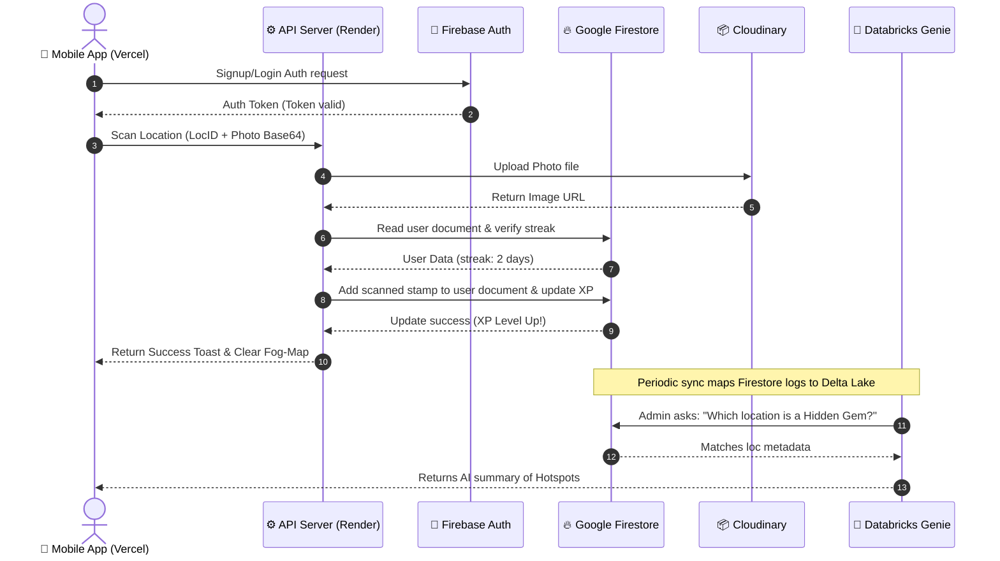
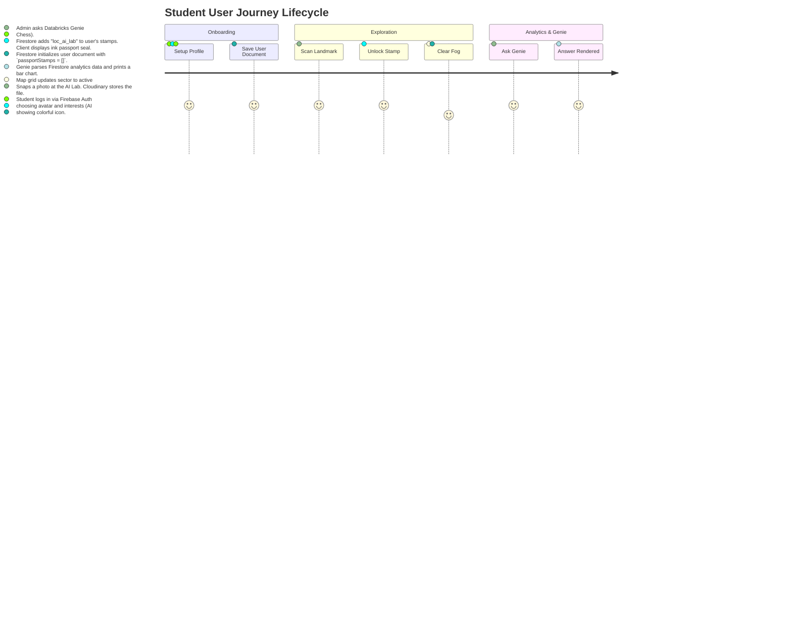

# 🗺️ Campus Social & Intelligence Platform - Full Project Architecture & Design Document

This document outlines the complete architectural design, end-to-end tech stack, data flows, user journeys, and database schemas for the **Campus Social & Intelligence Platform**. 

This revised version incorporates **Google Cloud Firestore** (NoSQL Database), **Databricks AI/BI Genie Agent** (Data Analytics chatbot), and details **free-tier production hosts** for each component of the system.

---

## 1. End-to-End System Architecture

```mermaid
graph TD
    User([📱 Mobile Client]) -->|HTTPS / WSS| Server[⚙️ Node.js API Server on Render]
    
    subgraph Frontend Client (Vercel Free Tier)
        User
    end

    subgraph Serverless Backend & Database (Firebase Free Tier)
        Server -->|Sync Data| DB[(🔥 Google Firestore NoSQL DB)]
        Auth[🔑 Firebase Auth]
        S3[📦 Cloudinary Object Storage]
    end

    subgraph Enterprise Analytics & AI Genie Agent (Databricks)
        DB -->|Sync Connector / GCS| Lake[🌊 Delta Lakehouse]
        Lake -->|Query Engine| Genie[🧠 Databricks Genie Agent]
    end

    subgraph Third-Party integrations (Free Tiers)
        Server -->|Image Uploads| S3
        User -->|Login authentication| Auth
    end
```

---

## 2. Tech Stack Breakdown (What Each Part is Used For & Free Tier Availability)

Every choice in this stack is selected to provide a **100% free-to-start development environment** with robust pricing tiers that scale up only when user traffic increases.

### A. Frontend (Client Tier)
*   **Next.js 14 & React 18**: A framework for building rapid, interactive mobile-responsive views.
*   **Hosting Provider**: **Vercel (Hobby Free Tier)**. 
    *   *What it is used for*: Deploys and serves the static assets, Next.js page routing, and animations.
    *   *Free limits*: Unlimited deployments, free custom domain connection (SSL included), and 100 GB bandwidth per month.

### B. Backend API & Real-time (Application Tier)
*   **Node.js & Express**: Simple, lightweight JavaScript server for managing scans, connections, and forum comments.
*   **Hosting Provider**: **Render (Free Web Services Tier)** or **Firebase Cloud Functions (Spark Free Tier)**.
    *   *What it is used for*: Handles incoming scan photo uploads, runs streak algorithms, and broadcasts active messaging triggers.
    *   *Free limits*: Firebase gives 2 million cloud execution invocations free per month. Render provides free web service hosting with automatic scaling.

### C. Database (Storage Tier)
*   **Google Cloud Firestore**: A serverless, NoSQL document-based database.
*   **Hosting Provider**: **Firebase Console / Google Cloud Platform (GCP Free Tier)**.
    *   *What it is used for*: Replaces traditional SQL databases to store unstructured JSON documents for users, DM chat threads, forum threads, map coordinates, and stamp items.
    *   *Free limits*: Highly generous **No-Credit-Card Free Tier** providing **50,000 free reads, 20,000 free writes, 20,000 free deletes per day**, and 1 GiB of permanent data storage.

### D. File Storage (Asset Tier)
*   **Cloudinary**: Media management platform.
*   **Hosting Provider**: **Cloudinary (Free Tier)**.
    *   *What it is used for*: Hosts uploaded images of campus spots taken by users. Instantly resizes and compresses photos on-the-fly to load quickly on mobile devices.
    *   *Free limits*: 25 free credits per month (equal to **25 GB of image storage or 25,000 image transformations**).

### E. AI Analytics (Databricks Genie Agent Tier)
*   **Databricks AI/BI Genie Agent**: A conversational data assistant that translates natural language queries into SQL to retrieve analytics from database storage.
*   **Hosting Provider**: **Databricks Community Edition (Free Tier)** combined with Firestore-to-Lakehouse sync.
    *   *What it is used for*: Allows administrators or students to ask conversational questions (e.g. *"Show me the most scanned building this week"* or *"How many students unlocked the Library stamp?"*) and displays automated charts and tables.
    *   *How it works*: Firestore database changes are automatically synced to Google Cloud Storage (GCS free tier up to 5 GB) using a Firebase Extension. Databricks mounts this GCS bucket as an external Delta Lake table, which the Genie Agent queries.

---

## 3. Data Flow Diagram



---

## 4. User Journey Map



---

## 5. Google Firestore Document Schema (NoSQL Collections)

NoSQL Firestore databases organize data in hierarchical **Collections** and **Documents** instead of relational rows and tables. Here is our production database layout:

### 1. `users` Collection
*   **Path**: `/users/{userId}`
```json
{
  "name": "New Explorer",
  "username": "freshman_xyz",
  "avatarUrl": "https://images.unsplash.com/.../avatar.jpg",
  "bio": "CS freshman looking for hackathon teams.",
  "level": 1,
  "xp": 45,
  "interests": ["AI", "Chess", "Gaming"],
  "skills": ["React", "Python"],
  "hobbies": ["Coffee"],
  "exploreStreak": 1,
  "lastScanDate": "2026-08-29",
  "joinedDate": "2026-08-29T14:00:00Z"
}
```

### 2. `locations` Collection
*   **Path**: `/locations/{locationId}`
```json
{
  "name": "Robotics & AI Research Lab",
  "building": "Engineering Block C",
  "floor": "3rd Floor",
  "coordinates": "C3",
  "rarity": "First to Document",
  "description": "State-of-the-art facility featuring robotic arms, edge computing systems, and project workspace panels.",
  "facilities": [
    "High-speed Wi-Fi network",
    "Hardware workstation bays",
    "GPU compute clusters"
  ],
  "tips": [
    "Scan the QR code on the main doors to register temporary lab cards.",
    "Quiet environment—perfect for working on team coding sprints."
  ]
}
```

### 3. `passport_stamps` Collection
*   **Path**: `/users/{userId}/stamps/{stampId}`
```json
{
  "locationId": "loc_ai_lab",
  "unlockedAt": "2026-08-29T14:05:00Z",
  "isFirstDocumenter": true,
  "locationName": "Robotics & AI Research Lab"
}
```

### 4. `messages` Collection
*   **Path**: `/chats/{chatId}/messages/{messageId}`
```json
{
  "senderId": "me",
  "receiverId": "user_alice",
  "text": "Check out this spot!",
  "imageUrl": "https://res.cloudinary.com/.../lab.jpg",
  "sharedLocationId": "loc_ai_lab",
  "timestamp": "2026-08-29T14:10:00Z"
}
```

### 5. `discussion_posts` Collection
*   **Path**: `/posts/{postId}`
```json
{
  "authorId": "me",
  "authorName": "New Explorer",
  "authorAvatar": "https://images.unsplash.com/.../avatar.jpg",
  "title": "Anyone attending the Robotics Hackathon next Tuesday?",
  "content": "Looking to form a team of 3. I have React experience, looking for Python backend devs!",
  "tag": "Hackathons",
  "likes": 5,
  "timestamp": "2026-08-29T14:15:00Z"
}
```
